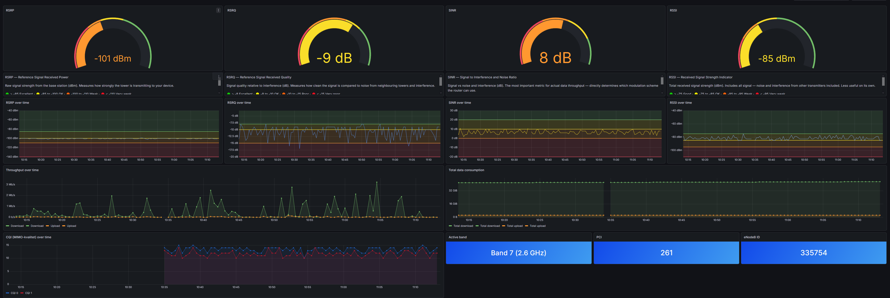

# Huawei B535-232 — Grafana Monitoring

Monitoring stack for the home 4G router (Huawei B535-232) via Prometheus and Grafana.

## What it does

Deploys a `huawei-lte-exporter` to the Kubernetes cluster that scrapes the Huawei B535 API and exposes LTE signal metrics for Prometheus:

**Signal quality**
- RSRP, RSRQ, RSSI, SINR — signal quality over time

**Network identity**
- Band, PCI, eNodeB ID, TAC, PLMN
- CQI carrier 0 & 1 (MIMO quality)
- DL/UL frequency and bandwidth

**Traffic**
- Uplink/downlink throughput (bps)
- Total data consumption (bytes)

## Structure

    router-grafana/
    ├── secret.example.yaml               # SealedSecret template — router credentials
    ├── registry-pull-secret.example.yaml # SealedSecret template — registry auth
    ├── deployment.yaml                   # huawei-lte-exporter
    ├── service.yaml                      # ClusterIP service
    └── servicemonitor.yaml               # Prometheus ServiceMonitor

## Prerequisites

- Kubernetes cluster
- Prometheus Operator
- Sealed Secrets controller (`kubeseal`)
- ArgoCD
- A container registry accessible from the cluster

## Getting started

1. Build and push the exporter image to your registry:
    docker build -t your-registry/huawei-lte-exporter:latest .
    docker push your-registry/huawei-lte-exporter:latest

2. Generate your secrets from the example templates:
    kubectl create secret generic huawei-lte-secret 
    --from-literal=username=your-username 
    --from-literal=password=your-password 
    --dry-run=client -o yaml | kubeseal --format yaml > secret.yaml
    kubectl create secret docker-registry registry-pull-secret 

    --docker-server=your-registry 
    --docker-username=your-username 
    --docker-password=your-token 
    --dry-run=client -o yaml | kubeseal --format yaml > registry-pull-secret.yaml

3. Update `deployment.yaml` with your registry image path and router address.

4. Apply via ArgoCD or `kubectl apply -k .`

## Dashboard preview

